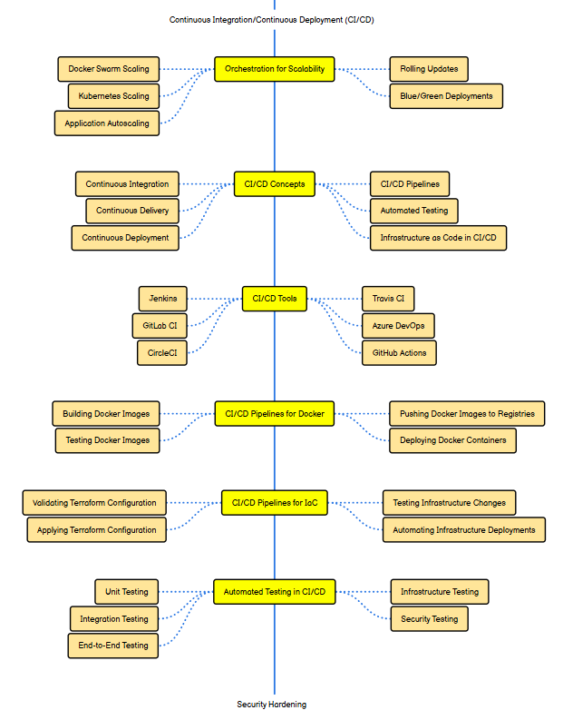
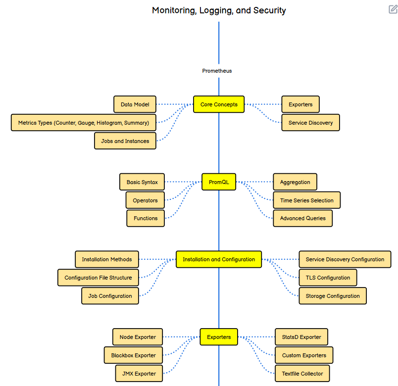

# 📘 DevOps Adoption Roadmap & Case Study Report
## 1. Introduction
In today’s fast-paced digital economy, businesses need to deliver software faster, more reliably, and with higher quality. Traditional IT models, which separate development and operations, often cause delays, miscommunication, and higher costs.

DevOps is a cultural and technical shift that integrates Development (Dev) and Operations (Ops) teams to collaborate closely, automate workflows, and continuously improve software delivery.

#### This report explores:
- Real-world DevOps transformations at Netflix and Amazon
- A DevOps Maturity Assessment Framework
- A 6-month DevOps Roadmap for adoption
- Metrics to measure success
- A comparison between DevOps vs Traditional IT

## 2. Case Studies of DevOps Transformation
### 🔹 Case Study 1: Netflix
#### Background:
In the early 2000s, Netflix faced massive challenges as it transitioned from DVD rentals to online streaming. With millions of users worldwide, downtime or errors could lead to loss of revenue and reputation.

#### Challenges Before DevOps:
- Slow release cycles
- Frequent system failures
- Scaling difficulties with growing user demand

#### DevOps Adoption:
* Adopted Continuous Integration & Continuous Delivery (CI/CD) pipelines for faster deployments.
* Implemented Microservices Architecture so small teams could work independently on features.
* Created the famous “Chaos Monkey” tool, which deliberately breaks systems in production to test resilience.

#### Results:
* Hundreds of deployments per day without downtime
* Improved system resilience and customer satisfaction
* Became the benchmark for modern cloud-native DevOps practices

## 🔹 Case Study 2: Amazon
#### Background:
Amazon, as one of the largest e-commerce platforms, had to ensure reliability, speed, and innovation while handling millions of daily transactions.

#### Challenges Before DevOps:
Amazon, being an e-commerce giant, struggled with:
* Frequent downtimes during peak sales
* Slow release cycles
* Difficulty managing large monolithic applications

#### DevOps Adoption:
Amazon pioneered DevOps with a “You build it, you run it” culture:
* Developers are responsible for the code they deploy
* Microservices + AWS Cloud allowed small independent teams
* Automated CI/CD pipelines → Faster updates
* Infrastructure as Code (IaC) → Scaling servers in minutes

#### Results:
* Deployment frequency increased dramatically (from once every few weeks → thousands per day).
* Reduced Mean Time to Recovery (MTTR) for failures.
* Faster innovation cycles, enabling new services like AWS, Alexa, and Prime.

## 3. DevOps Maturity Assessment Framework
Organizations don’t adopt DevOps overnight—it’s a journey. Below is a 4-stage maturity model:
| Stage          | Culture & Teams                | Tools & Processes                                  | Metrics                                    | Example Company |
| -------------- | ------------------------------ | -------------------------------------------------- | ------------------------------------------ | --------------- |
| **Initial**    | Siloed teams, manual work      | Few tools, ad-hoc deployments                      | Long release cycles                        | Traditional IT  |
| **Developing** | Basic collaboration, CI/CD     | Git, Jenkins, Docker basics                        | Deployment monthly/weekly                  | Small startups  |
| **Mature**     | Full CI/CD + Containers + IaC  | Kubernetes, Terraform, Monitoring                  | Daily deployments, MTTR ↓                  | Amazon          |
| **Elite**      | Fully automated, AI-driven Ops | Chaos engineering, GitOps, Cloud-native everything | Deployments in seconds, near zero downtime | Netflix         |

## 4. Six-Month DevOps Adoption Roadmap
Here’s a step-by-step 6-month roadmap for a startup transitioning to DevOps:

### 📅 Month 1–2: Version Control + CI/CD Basics
* Learn Git (branching, merging, pull requests)
* Set up a basic CI/CD pipeline (e.g., GitHub Actions, Jenkins, GitLab CI)
* Introduce automated testing for faster feedback
* Outcome: Code is version-controlled, tested, and deployed automatically to a staging environment

**Link**
https://roadmap.sh/r/git-basics--cicd-branching-merging-prs-automated-tests-and-staging-deployment-for-streamlined-workflow

### 📅 Month 3–4: Containerization + Infrastructure as Code
* Learn Docker to package apps into containers
* Use Docker Compose for local multi-service environments
* Begin Infrastructure as Code (IaC) with Terraform or Ansible
* Outcome: Consistent environments across dev/staging/production, scalable infrastructure

**Link**
https://roadmap.sh/r/docker--docker-compose-for-containers-start-iac-with-terraformansible-outcome-consistent-scalable-devstagingprod-environments

### 📅 Month 5–6: Monitoring + Security
* Implement monitoring tools (Prometheus, Grafana, ELK Stack)
* Introduce logging and alerting for incidents
* Apply DevSecOps practices (security scanning with tools like SonarQube, Trivy)
* Outcome: Systems are monitored, secure, and resilient with rapid recovery capabilities

**Link**
https://roadmap.sh/r/monitoring-with-prometheusgrafanaelk-add-logging--alerts-apply-devsecops-sonarqube-trivy-outcome-secure-resilient-systems

## 5. Workflow Example (Real-World Case Study Flow)
Here’s how the workflow looks in a DevOps-enabled company like Netflix:
1. Developer writes code → commits to GitHub
2. CI/CD pipeline builds, tests, and deploys code automatically
3. Application is containerized with Docker → deployed to Kubernetes cluster
4. Infrastructure is managed via Terraform (IaC)
5. Monitoring tools (Prometheus + Grafana) track performance
6. Chaos Monkey randomly shuts down servers → system self-recovers without downtime
7. Metrics like deployment frequency and MTTR are tracked for improvement

## 6. Metrics for Success (KPIs)
To measure DevOps adoption, the following KPIs are tracked:
* Deployment Frequency → How often code is deployed
* Lead Time for Changes → Time taken from commit to production
* MTTR (Mean Time to Recovery) → Time to recover from failure
* Change Failure Rate → % of deployments causing failures

## 7. DevOps vs Traditional IT
| Factor               | Traditional IT      | DevOps                          |
| -------------------- | ------------------- | ------------------------------- |
| **Team Structure**   | Siloed (Dev vs Ops) | Collaborative, cross-functional |
| **Release Cycle**    | Weeks to months     | Daily or multiple times a day   |
| **Deployment**       | Manual, error-prone | Automated, reliable             |
| **Scalability**      | Difficult           | Cloud-native, scalable          |
| **Innovation Speed** | Slow                | Fast, agile                     |

## 8. Conclusion
Adopting DevOps is not just about tools—it’s about culture, automation, and continuous improvement. Companies like Netflix and Amazon showcase the true power of DevOps, enabling faster delivery, improved resilience, and higher customer satisfaction.

